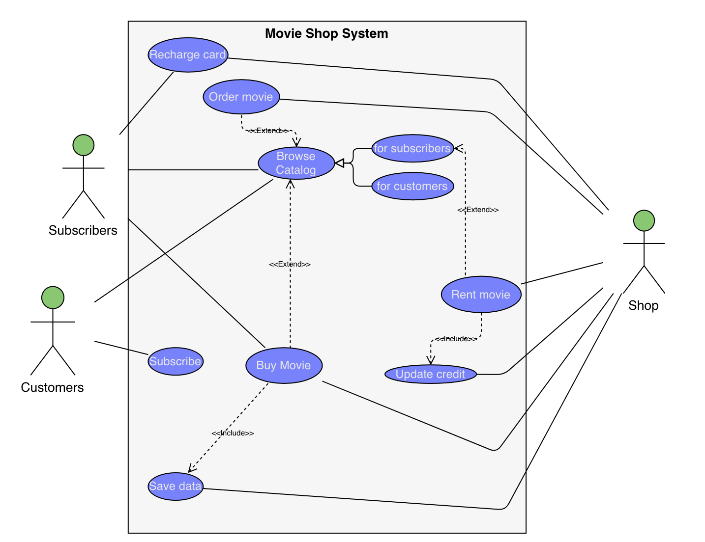
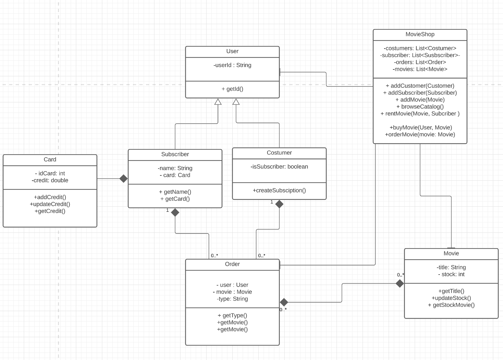

# Enterprise-Java-Development-2.06

## Lab 2.06: System Design

**3 .Create a use case diagram and a class diagram for an online banking system. Think through what the essential functions of an online banking application are. Users at a minimum should be able to transfer funds, withdraw their accounts, and deposit to their accounts. Admins should be able to freeze accounts in the event of fraud. Don’t forget to use the Money Class in your class diagram.**

## Case Diagram

## Class Diagram
